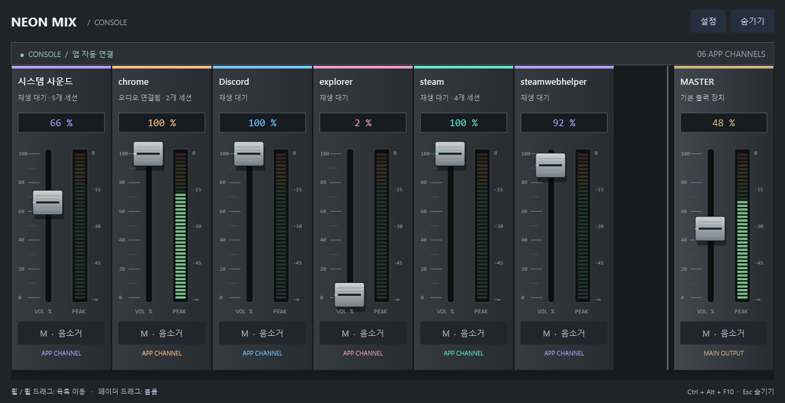

# Neon Mix

게임 소리, 음성 채팅, 음악을 앱별로 조절하는 Windows용 작은 오디오 믹서입니다.
Cakewalk의 믹싱 콘솔에서 아이디어를 얻어, 각 앱을 가로로 나열된 세로 페이더로 표시합니다.



## 다운로드 및 실행

1. [최신 릴리스](https://github.com/Hyun-woo-Kim/neon-mix/releases/latest)에서 `NeonMix-Console-v0.2.0-Windows.zip`을 받습니다.
2. 압축을 풀고 `NeonMix.exe`를 실행합니다. 폴더 안의 파일을 함께 보관하세요.
3. 실행에 필요한 **.NET 10 Desktop Runtime**이 없으면 [Microsoft 다운로드 페이지](https://dotnet.microsoft.com/en-us/download/dotnet/10.0)에서 Windows용 Desktop Runtime을 설치합니다.

이전 버전이 실행 중이면 트레이 아이콘을 우클릭하고 **종료**한 뒤 새 버전을 실행하세요.

## 조작

| 하고 싶은 일 | 조작 |
| --- | --- |
| 앱별 볼륨 조절 | 페이더 손잡이를 위아래로 드래그 |
| 채널 목록 이동 | 휠 스크롤 또는 휠 버튼을 누른 채 좌우 드래그 |
| 해당 앱 음소거 | 채널의 M 버튼 |
| 전체 출력 조절 | 오른쪽에 고정된 MASTER 페이더 |
| 믹서 열기 / 숨기기 | 기본 `Ctrl + Alt + M` |
| 창 숨기기 | `Esc`, × 또는 숨기기 버튼 |
| 완전히 종료하기 | 트레이 아이콘 우클릭 → 종료 |

- 앱에서 소리를 한 번 재생해 Windows 오디오 세션이 생기면 약 1초 간격의 갱신으로 감지합니다.
- 페이더 위에서도 휠은 목록을 이동합니다. 볼륨과 목록 이동 입력을 분리했습니다.
- PEAK 미터는 실제 오디오 신호를 표시합니다. 여러 세션의 경우 가장 큰 피크를 사용합니다.
- 단축키가 사용 중이면 `Ctrl + Alt + F9`, `Ctrl + Alt + F10`, `Alt + Shift + M` 순서로 사용 가능한 조합을 찾습니다. 현재 단축키는 창 아래에 표시됩니다.
- 설정에서 단축키와 항상 위에 표시 여부를 저장할 수 있습니다.

## 현재 범위

**앱과 게임별 호환성을 확인 중인 초기 버전**입니다. Windows 11 환경에서 실제 오디오 세션의 볼륨·음소거 변경과 새 세션 감지, 페이더 위 휠 목록 이동, 마스터 위치 고정, 창 복원과 단축키 등록을 확인했습니다.

- 게임 내부에 삽입되는 오버레이가 아닌 독립 데스크톱 창입니다. 독점 전체화면에서는 Alt+Tab으로 전환해야 할 수 있습니다.
- Fn 키 자체를 단축키로 등록하지 않습니다. 키보드 설정으로 F9/F10을 입력하거나 지정한 단축키를 보내는 방식으로 사용합니다.
- 같은 프로세스 이름의 세션은 한 채널로 묶습니다. 페이더를 조절하면 해당 세션들을 같은 볼륨으로 맞춥니다.
- MASTER는 기본 멀티미디어 출력 장치를 조절합니다. 다른 출력 장치로 보낸 앱에는 영향을 주지 않을 수 있습니다.
- 자동 시작을 등록하지 않습니다. 설정은 `%LOCALAPPDATA%\NeonMix\settings.json`에 저장합니다.

자세한 동작은 [사용 안내](사용%20안내.md)를 확인하세요. 문제가 있다면 [Issues](https://github.com/Hyun-woo-Kim/neon-mix/issues)에 사용한 앱/게임, Windows 버전, 재현 방법을 남겨주세요.

## 개발

Windows와 .NET 10 SDK가 필요합니다. WPF와 Windows Core Audio API를 사용하며 별도 오디오 라이브러리 패키지는 사용하지 않습니다.

```powershell
dotnet build -c Release
dotnet publish -c Release -o dist/app
```

```powershell
./dist/app/NeonMix.exe --self-test
./dist/app/NeonMix.exe --smoke-test
```

`--self-test`는 무음 테스트 세션의 볼륨·음소거를 확인하고 원래 값으로 복원합니다. `--smoke-test`는 실제 목록을 표시해 UI 갱신과 휠 스크롤 등을 확인하고 종료합니다. 결과 파일은 실행 파일 폴더에 생성됩니다.

## 참고

콘솔 배치는 Cakewalk에서 영감을 받았습니다. Cakewalk와 관련되거나 공식 지원되는 제품은 아닙니다.
